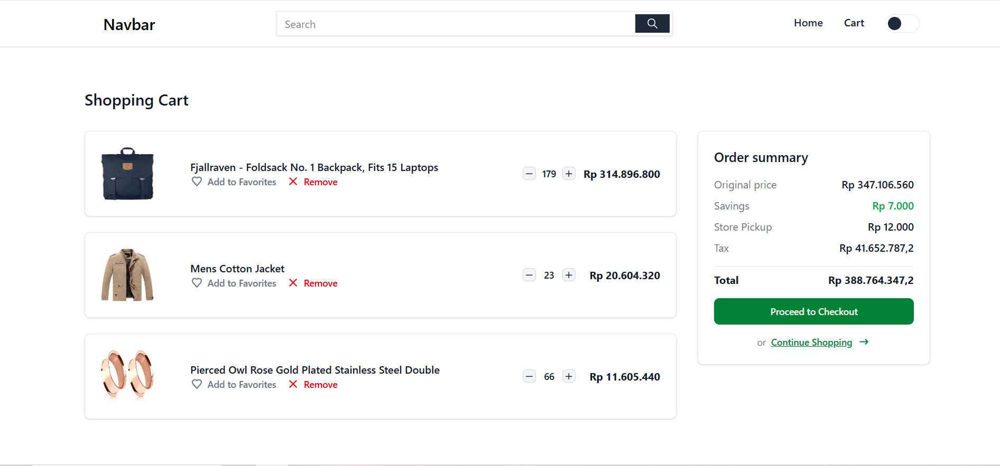

🛍️ product-viewer-app
A simple and minimal React application built with Vite that displays product data from Fake Store API. This app includes category filtering, a search bar, and a shopping cart that totals the selected items' prices.

🔎 Preview

🚀 Features
🔄 Fast Refresh via Vite

📦 Displays product data from Fake Store API

🔍 Search bar for filtering products by name/title

🗂️ Category filter to view products by category

🛒 Shopping cart to collect and total selected items

🌙 Dark mode toggle to match user preference

✅ Basic ESLint rules configured

💡 Ready to expand with TypeScript and type-aware linting

📦 Tech Stack
React

Vite

JavaScript

ESLint

Tailwind

🧑‍💻 Getting Started
git clone https://github.com/mdbahrulilmi/product-viewer-app.git
cd product-viewer-app
npm install
npm run dev
